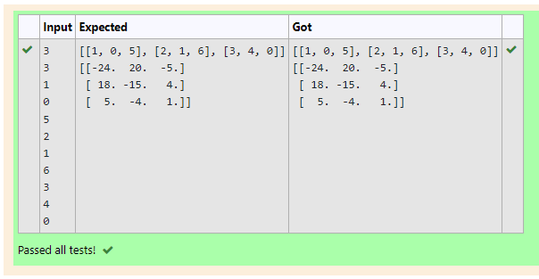

# Inverse-of-matrix

## AIM:
To write a python program to find inverse a matrix.
## ALGORITHM:
### Step 1:
Start python program.
### Step 2:
Import numpy.Create two null lists.
### Step 3:
Get the parameters and the elements from the user using for loops.
### Step 4:
Inverse the matrix using linalg library.  
### Step 5:
End the program.

## PROGRAM:
```
#Name: SRIJITH R
#Reference Number: 21004191
import numpy
rows=int(input())
columns=int(input())
l1=[]
for i in range(rows):
    temp=[]
    for j in range(columns):
        t=int(input())
        temp+=[t]
    l1+=[temp]
print(l1)
print(numpy.linalg.inv(l1))
```
## OUTPUT:

## RESULT:
A python program to find inverse a matrix has been created successfully.